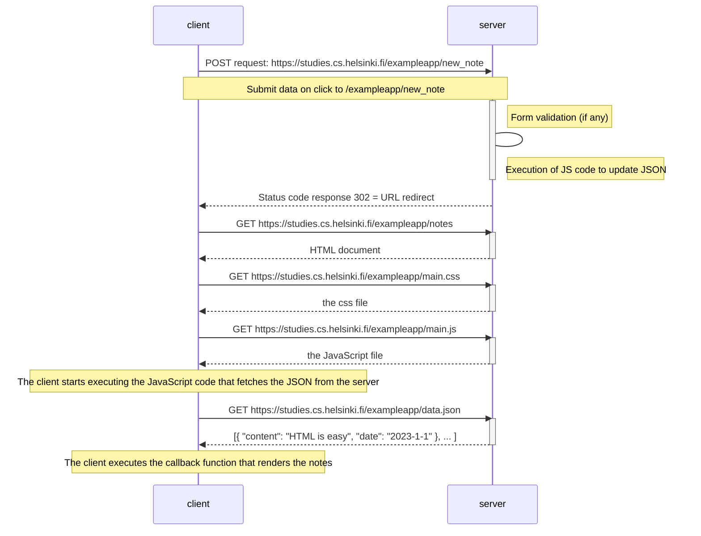

```mermaid
sequenceDiagram
    participant client
    participant server

    client->>server: POST request:  https://studies.cs.helsinki.fi/exampleapp/new_note
    Note over client,server: Submit data on click to /exampleapp/new_note
    activate server
    Note right of server: Form validation (if any)
    server->server: 
    Note right of server: Execution of JS code to update JSON
    deactivate server

    server-->>client: Status code response 302 = URL redirect

    client->>server: GET https://studies.cs.helsinki.fi/exampleapp/notes
    activate server
    server-->>client: HTML document
    deactivate server

    client->>server: GET https://studies.cs.helsinki.fi/exampleapp/main.css
    activate server
    server-->>client: the css file
    deactivate server

    client->>server: GET https://studies.cs.helsinki.fi/exampleapp/main.js
    activate server
    server-->>client: the JavaScript file
    deactivate server

    Note over client: The client starts executing the JavaScript code that fetches the JSON from the server

    client->>server: GET https://studies.cs.helsinki.fi/exampleapp/data.json
    activate server
    server-->>client: [{ "content": "HTML is easy", "date": "2023-1-1" }, ... ]
    deactivate server

    Note over client: The client executes the callback function that renders the notes
```