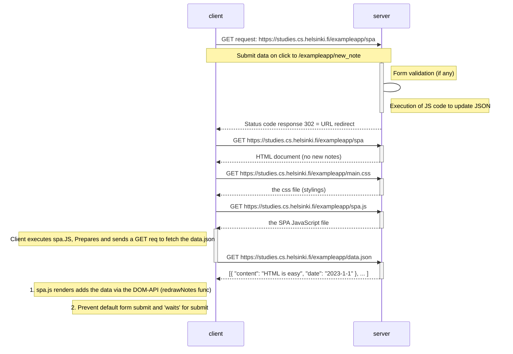

```mermaid
sequenceDiagram
    participant client
    participant server

    client->>server: GET request:  https://studies.cs.helsinki.fi/exampleapp/spa
    Note over client,server: Submit data on click to /exampleapp/new_note
    activate server
    Note right of server: Form validation (if any)
    server->server: 
    Note right of server: Execution of JS code to update JSON
    deactivate server

    server-->>client: Status code response 302 = URL redirect

    client->>server: GET https://studies.cs.helsinki.fi/exampleapp/spa
    activate server
    server-->>client: HTML document (no new notes)
    deactivate server

    client->>server: GET https://studies.cs.helsinki.fi/exampleapp/main.css
    activate server
    server-->>client: the css file (stylings)
    deactivate server

    client->>server: GET https://studies.cs.helsinki.fi/exampleapp/spa.js
    activate server
    server-->>client: the SPA JavaScript file
    deactivate server
    activate client
    Note left of client: Client executes spa.JS, Prepares and sends a GET req to fetch the data.json

    client->>server: GET https://studies.cs.helsinki.fi/exampleapp/data.json
    deactivate client
    activate server
    server-->>client: [{ "content": "HTML is easy", "date": "2023-1-1" }, ... ]
    deactivate server

    Note left of client: 1. spa.js renders adds the data via the DOM-API (redrawNotes func)
    Note left of client: 2. Prevent default form submit and 'waits' for submit
```