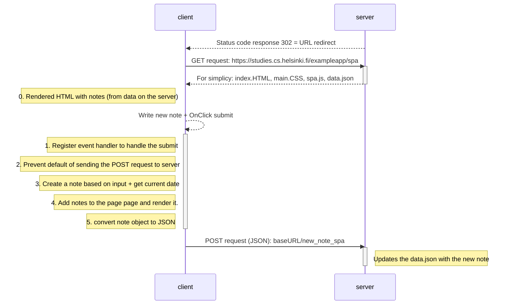

```mermaid
sequenceDiagram
    participant client
    participant server

    server-->>client: Status code response 302 = URL redirect

    client->>server: GET request: https://studies.cs.helsinki.fi/exampleapp/spa
    activate server
    server-->>client: For simplicy: index.HTML, main.CSS, spa.js, data.json 
    deactivate server
    Note left of client: 0. Rendered HTML with notes (from data on the server)
    client-->>client: Write new note + OnClick submit
    activate client
    Note left of client: 1. Register event handler to handle the submit
    Note left of client: 2. Prevent default of sending the POST request to server
    Note left of client: 3. Create a note based on input + get current date
    Note left of client: 4. Add notes to the page page and render it.
    Note left of client: 5. convert note object to JSON
    deactivate client

    client->>server: POST request (JSON): 	baseURL/new_note_spa
    activate server
    Note right of server: Updates the data.json with the new note
    deactivate server
    

```